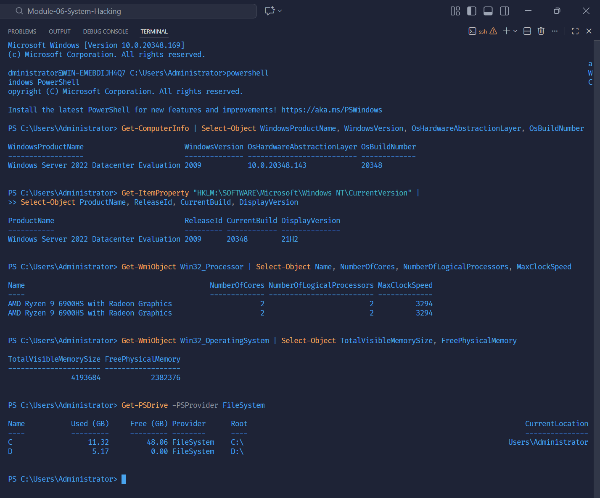
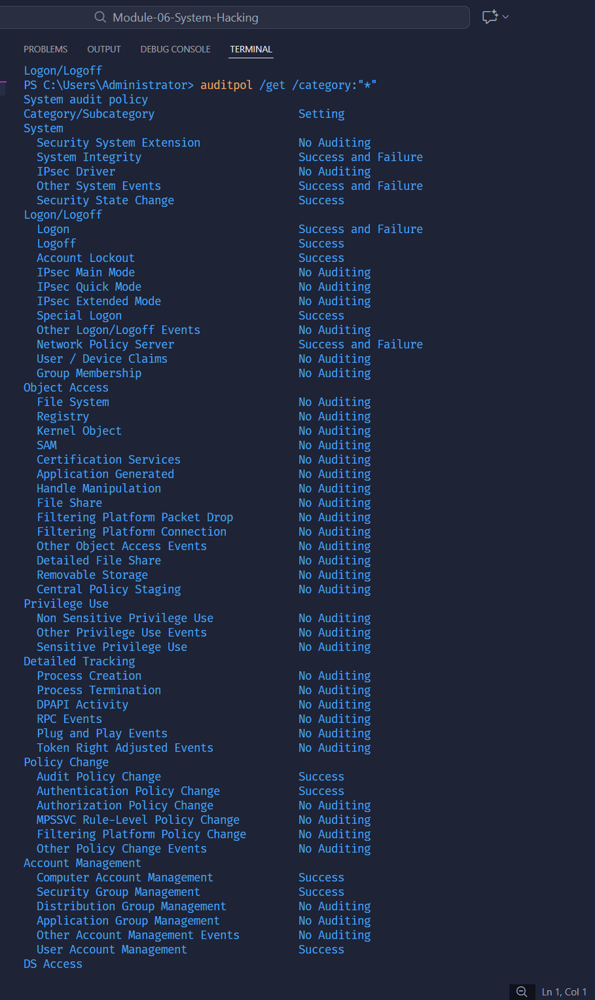
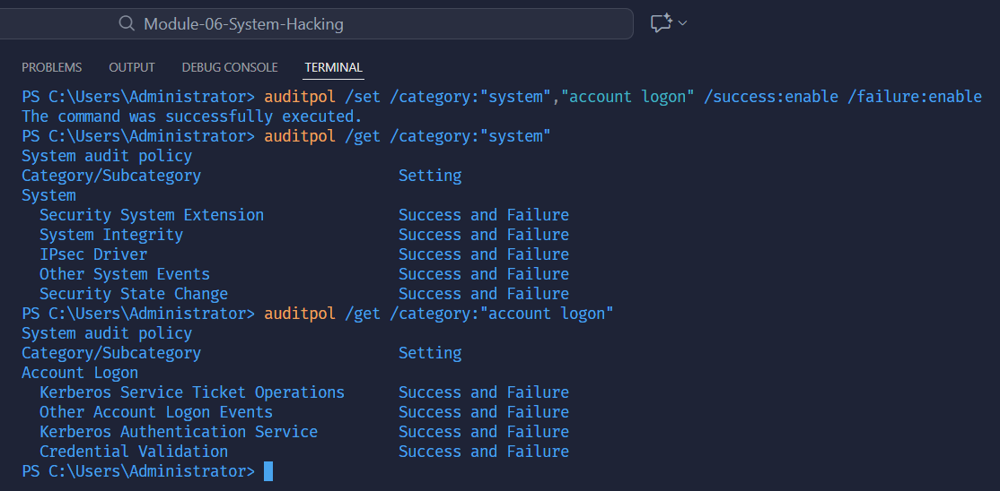
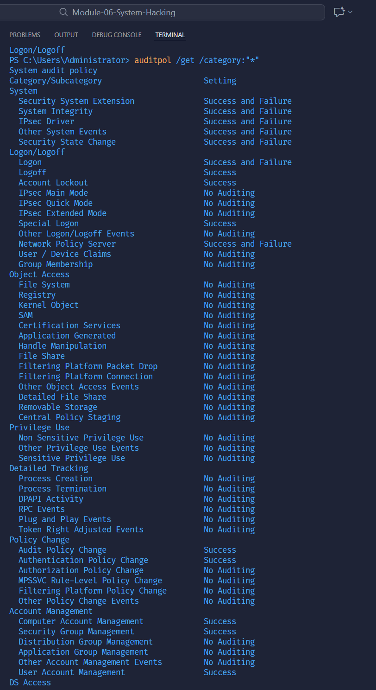

# Lab 16 – AuditPol System Auditing on Windows Server

This repository contains the full execution steps, screenshots, and final report for **CEH Module 06 – System Hacking (AuditPol)** performed on **Windows Server 2022**.

---

## 📌 Overview

The purpose of this lab is to:

- View current audit policies using `auditpol`
- Enable System & Account Logon auditing
- Verify policy changes
- Clear all audit configurations
- Validate that policies were successfully cleared

All screenshots and markdown reports are included in the `Lab-16-Auditpol` folder.

---

## 🧪 Lab Steps Summary

### **1. View all audit policies**
```powershell
auditpol /get /category:"*"
```
**Result:** The system displayed default audit configuration (mostly *No Auditing*).



---

### **2. Enable System & Account Logon auditing**
```powershell
auditpol /set /category:"system","account logon" /success:enable /failure:enable
```

Verification:
```powershell
auditpol /get /category:"system"
auditpol /get /category:"account logon"
```



---

### **3. Confirm all audit categories**
```powershell
auditpol /get /category:"*"
```



---

### **4. Clear all audit policies**
```powershell
auditpol /clear /y
```

Verification:
```powershell
auditpol /get /category:"*"
```



---

## 📝 Final Report

Click the link below to view the complete formatted lab report (PDF):

👉 **[slide-report/Lab-16.md](./slide-report/Lab16-Auditpol.pdf)**

---

## ✔️ Conclusion

This lab demonstrates:

- How to inspect audit settings in Windows Server  
- How to enable targeted audit categories  
- How to completely reset the auditing system  
- How to verify every step with AuditPol  

This ensures proper understanding of Windows logging behavior for security monitoring and incident response.
